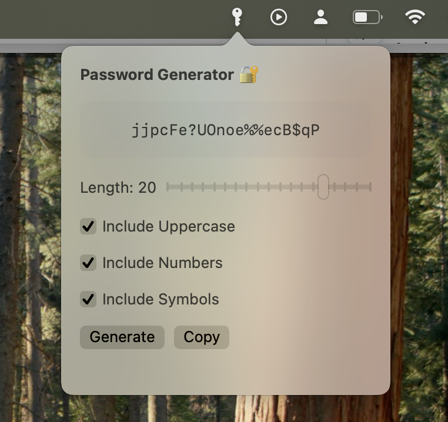

# 🔐 Password Generator Menu Bar (macOS)

Um app nativo para **macOS** feito em **Swift + SwiftUI**, que fica na **menu bar** e gera **senhas seguras aleatórias** com um clique. Ideal para quem quer praticidade, segurança e um visual minimalista.

 

---

## ✨ Funcionalidades

- Ícone discreto na **barra de menu do macOS**
- Geração de senhas seguras com opções:
  - Tamanho personalizável (6 a 24 caracteres)
  - Letras maiúsculas e minúsculas
  - Números
  - Símbolos
- Botão para **copiar senha para a área de transferência**
- Popover elegante com interface SwiftUI
- Fecha automaticamente ao clicar fora do popover

---

## 🖥️ Tecnologias Usadas

| Recurso               | Finalidade                           |
|-----------------------|--------------------------------------|
| Swift + SwiftUI       | Interface moderna                    |
| AppKit (`NSStatusBar`) | Ícone na barra de menu               |
| `NSPopover`           | Janela flutuante                     |
| `NSPasteboard`        | Copiar senha para clipboard          |
| `EventMonitor`        | Fecha o popover ao clicar fora       |

---

## 🚀 Como Rodar o Projeto

1. **Abra o Xcode**
2. Vá em `File > New > Project`
3. Escolha:
   - Plataforma: `macOS`
   - Tipo: `App`
   - Interface: `SwiftUI`
   - Lifecycle: `App`
4. Cole os arquivos do projeto:
   - `AppDelegate.swift`
   - `EventMonitor.swift`
   - `ContentView.swift`
   - `PasswordGenerator.swift`
   - Atualize `SeuProjetoApp.swift` para usar `@NSApplicationDelegateAdaptor`
5. Rode com `Cmd + R`

---

## 📂 Estrutura

PasswordGeneratorMenuBar/

├── AppDelegate.swift

├── EventMonitor.swift

├── ContentView.swift

├── PasswordGenerator.swift

├── PasswordGeneratorMenuBarApp.swift

└── Assets.xcassets

---

## 📋 Exemplo de Uso

1. Abra o app (ícone aparecerá na menu bar: 🔑)
2. Clique no ícone → popover aparece
3. Escolha as opções e clique em "Generate"
4. Clique em "Copy" → senha é copiada para a área de transferência
5. Use onde precisar 💪

---

## 📚 Fontes de Apoio

- Apple Docs – [NSStatusBar](https://developer.apple.com/documentation/appkit/nsstatusbar)
- Hacking with Swift – [Menu bar app com SwiftUI](https://www.hackingwithswift.com/articles/244/how-to-create-a-menu-bar-app-using-swiftui)
- Apple Docs – [NSPasteboard](https://developer.apple.com/documentation/appkit/nspasteboard)

---

## 🧑‍💻 Autor

Projeto criado por **Elias Montan** como aprendizado prático com Swift para macOS.

---

